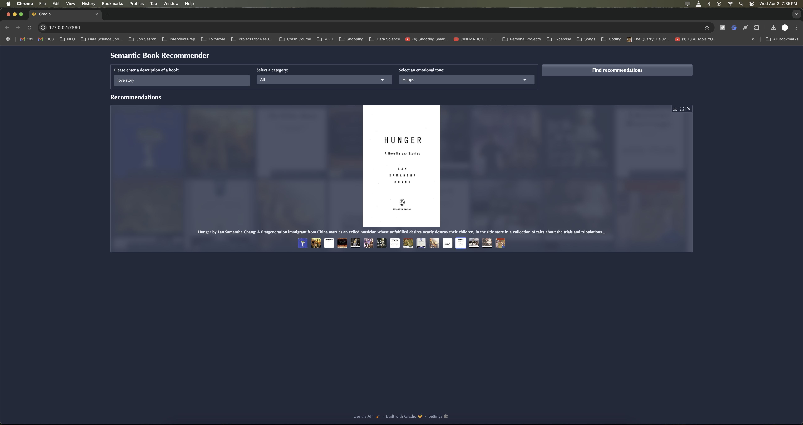

# AI-Powered Book Recommendation Engine

An intelligent book recommendation engine that leverages **Large Language Models (LLMs)** and **semantic search** to suggest books based on content understanding rather than just keywords.

## ✨ Features

- **Semantic Search**: Uses OpenAI embeddings and ChromaDB to find books with similar themes/descriptions
- **Smart Categorization**: Zero-shot classification (78% accuracy) with Hugging Face's BART model
- **Emotion Filtering**: Sentiment analysis via fine-tuned RoBERTa (66% accuracy)
- **User-Friendly Interface**: Interactive Gradio dashboard with filters
- **Scalable Pipeline**: From data cleaning to deployment-ready system

## 🛠️ Technologies Used

| Category       | Technologies |
|----------------|-------------|
| **Core ML**    | OpenAI Embeddings, Hugging Face Transformers (BART, RoBERTa) |
| **NLP**        | Zero-shot Classification, Sentiment Analysis, Semantic Search |
| **Data**       | Pandas, NumPy, Seaborn |
| **Vector DB**  | ChromaDB |
| **Framework**  | LangChain |
| **UI**         | Gradio |
| **Languages**  | Python |

## 📸 Screenshots

  
  
  
<em>Left: Gradio interface with filters | Right: Example recommendations</em>

